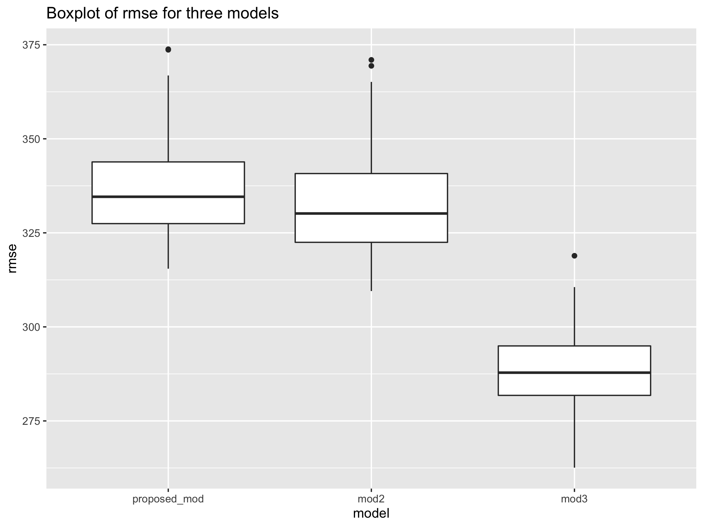
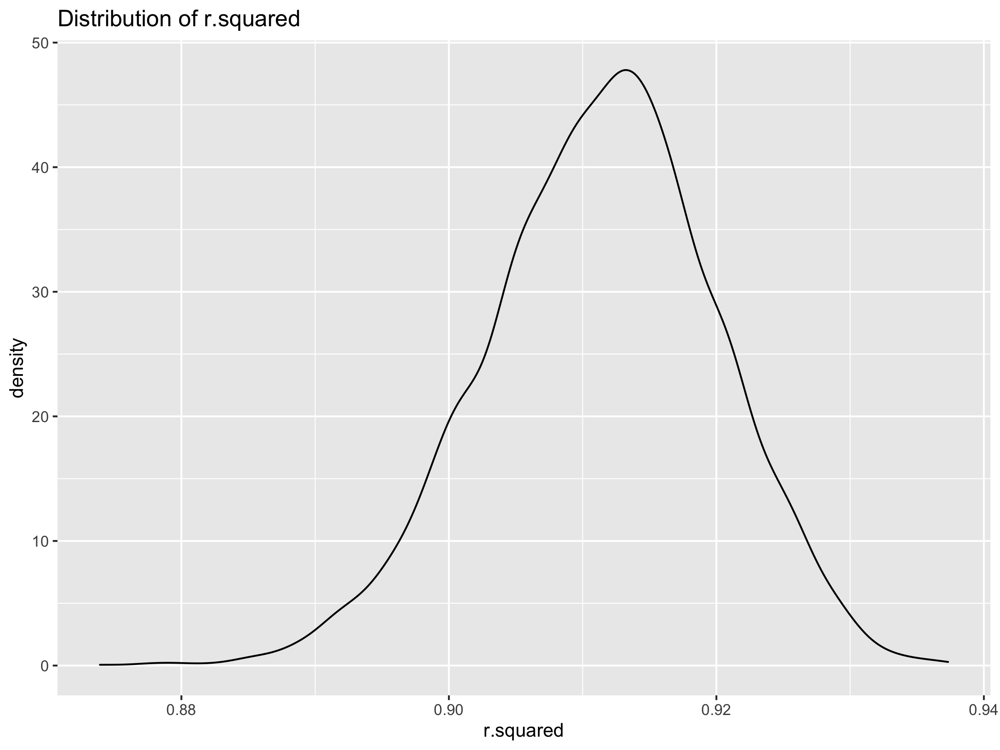

P8105\_HW6\_YZ4181
================
Yuanyuan Zeng(yz4181)
11/30/2021

## Problem 1

``` r
birthweigh = read_csv("./birthweight.csv") %>% 
  mutate(
    babysex = recode(babysex, `1` = "male", `2` = "female"),
    babysex = factor(babysex),
    frace = recode(frace, 
                   `1` = "White",
                   `2` = "Black",
                   `3` = "Asian",
                   `4` = "Peutro",
                   `8` = "Other"),
    frace = factor(frace),
    mrace = recode(mrace,
                   `1` = "White",
                   `2` = "Black",
                   `3` = "Asian",
                   `4` = "Peutro",
                   `8` = "Other" ),
    mrace = factor(mrace),
    malform = recode(malform, `0` = "Absent", `1` = "Present"),
    malform = factor(malform))

head(birthweigh,10)
```

    ## # A tibble: 10 × 20
    ##    babysex bhead blength   bwt delwt fincome frace gaweeks malform menarche
    ##    <fct>   <dbl>   <dbl> <dbl> <dbl>   <dbl> <fct>   <dbl> <fct>      <dbl>
    ##  1 female     34      51  3629   177      35 White    39.9 Absent        13
    ##  2 male       34      48  3062   156      65 Black    25.9 Absent        14
    ##  3 female     36      50  3345   148      85 White    39.9 Absent        12
    ##  4 male       34      52  3062   157      55 White    40   Absent        14
    ##  5 female     34      52  3374   156       5 White    41.6 Absent        13
    ##  6 male       33      52  3374   129      55 White    40.7 Absent        12
    ##  7 female     33      46  2523   126      96 Black    40.3 Absent        14
    ##  8 female     33      49  2778   140       5 White    37.4 Absent        12
    ##  9 male       36      52  3515   146      85 White    40.3 Absent        11
    ## 10 male       33      50  3459   169      75 Black    40.7 Absent        12
    ## # … with 10 more variables: mheight <dbl>, momage <dbl>, mrace <fct>,
    ## #   parity <dbl>, pnumlbw <dbl>, pnumsga <dbl>, ppbmi <dbl>, ppwt <dbl>,
    ## #   smoken <dbl>, wtgain <dbl>

``` r
# check for missing value
skimr::skim(birthweigh)
```

|                                                  |            |
|:-------------------------------------------------|:-----------|
| Name                                             | birthweigh |
| Number of rows                                   | 4342       |
| Number of columns                                | 20         |
| \_\_\_\_\_\_\_\_\_\_\_\_\_\_\_\_\_\_\_\_\_\_\_   |            |
| Column type frequency:                           |            |
| factor                                           | 4          |
| numeric                                          | 16         |
| \_\_\_\_\_\_\_\_\_\_\_\_\_\_\_\_\_\_\_\_\_\_\_\_ |            |
| Group variables                                  | None       |

Data summary

**Variable type: factor**

| skim\_variable | n\_missing | complete\_rate | ordered | n\_unique | top\_counts                             |
|:---------------|-----------:|---------------:|:--------|----------:|:----------------------------------------|
| babysex        |          0 |              1 | FALSE   |         2 | mal: 2230, fem: 2112                    |
| frace          |          0 |              1 | FALSE   |         5 | Whi: 2123, Bla: 1911, Peu: 248, Asi: 46 |
| malform        |          0 |              1 | FALSE   |         2 | Abs: 4327, Pre: 15                      |
| mrace          |          0 |              1 | FALSE   |         4 | Whi: 2147, Bla: 1909, Peu: 243, Asi: 43 |

**Variable type: numeric**

| skim\_variable | n\_missing | complete\_rate |    mean |     sd |     p0 |     p25 |     p50 |     p75 |   p100 | hist  |
|:---------------|-----------:|---------------:|--------:|-------:|-------:|--------:|--------:|--------:|-------:|:------|
| bhead          |          0 |              1 |   33.65 |   1.62 |  21.00 |   33.00 |   34.00 |   35.00 |   41.0 | ▁▁▆▇▁ |
| blength        |          0 |              1 |   49.75 |   2.72 |  20.00 |   48.00 |   50.00 |   51.00 |   63.0 | ▁▁▁▇▁ |
| bwt            |          0 |              1 | 3114.40 | 512.15 | 595.00 | 2807.00 | 3132.50 | 3459.00 | 4791.0 | ▁▁▇▇▁ |
| delwt          |          0 |              1 |  145.57 |  22.21 |  86.00 |  131.00 |  143.00 |  157.00 |  334.0 | ▅▇▁▁▁ |
| fincome        |          0 |              1 |   44.11 |  25.98 |   0.00 |   25.00 |   35.00 |   65.00 |   96.0 | ▃▇▅▂▃ |
| gaweeks        |          0 |              1 |   39.43 |   3.15 |  17.70 |   38.30 |   39.90 |   41.10 |   51.3 | ▁▁▂▇▁ |
| menarche       |          0 |              1 |   12.51 |   1.48 |   0.00 |   12.00 |   12.00 |   13.00 |   19.0 | ▁▁▂▇▁ |
| mheight        |          0 |              1 |   63.49 |   2.66 |  48.00 |   62.00 |   63.00 |   65.00 |   77.0 | ▁▁▇▂▁ |
| momage         |          0 |              1 |   20.30 |   3.88 |  12.00 |   18.00 |   20.00 |   22.00 |   44.0 | ▅▇▂▁▁ |
| parity         |          0 |              1 |    0.00 |   0.10 |   0.00 |    0.00 |    0.00 |    0.00 |    6.0 | ▇▁▁▁▁ |
| pnumlbw        |          0 |              1 |    0.00 |   0.00 |   0.00 |    0.00 |    0.00 |    0.00 |    0.0 | ▁▁▇▁▁ |
| pnumsga        |          0 |              1 |    0.00 |   0.00 |   0.00 |    0.00 |    0.00 |    0.00 |    0.0 | ▁▁▇▁▁ |
| ppbmi          |          0 |              1 |   21.57 |   3.18 |  13.07 |   19.53 |   21.03 |   22.91 |   46.1 | ▃▇▁▁▁ |
| ppwt           |          0 |              1 |  123.49 |  20.16 |  70.00 |  110.00 |  120.00 |  134.00 |  287.0 | ▅▇▁▁▁ |
| smoken         |          0 |              1 |    4.15 |   7.41 |   0.00 |    0.00 |    0.00 |    5.00 |   60.0 | ▇▁▁▁▁ |
| wtgain         |          0 |              1 |   22.08 |  10.94 | -46.00 |   15.00 |   22.00 |   28.00 |   89.0 | ▁▁▇▁▁ |

-   The original data set includes 4342 observations and 20 variables.
    There is no missing value. The variable of baby sex, father race,
    mother race, and malformations are re-coded based on the information
    and converted into factors. Other variables remain as numeric.

#### Propose regression model

``` r
propose_model= lm(bwt ~ blength + delwt + babysex, data = birthweigh) # regression model

propose_model %>% broom::tidy() %>% 
  select(term, estimate, p.value) %>% 
  mutate(
    term = replace(term, term == "blength", "baby's length"),
    term = replace(term, term == "delwt", "mother's weight at delivery"),
    term = replace(term, term == "babysexmale", "baby sex (male)")
  ) %>% 
  knitr::kable(digits = 3)
```

| term                        |  estimate | p.value |
|:----------------------------|----------:|--------:|
| (Intercept)                 | -3987.529 |   0.000 |
| baby’s length               |   134.276 |   0.000 |
| mother’s weight at delivery |     2.862 |   0.000 |
| baby sex (male)             |     9.658 |   0.348 |

-   The birth weight of the baby depends on baby’s length at birth,
    baby’s sex and mother’s weight at delivery. We assume there is no
    interaction between the predictors and this proposed model only
    include the main effects. Increasing in one unit of length leads to
    increase baby weight by 134.276 grams. One unit increase of mother’s
    weight at delivery leads to increase baby weight by 2.862 grams.
    Being males increases weight by 9.658 grams comparing with females.

#### Diagnostics

``` r
birthweigh %>% 
  modelr::add_residuals(propose_model) %>% 
  modelr::add_predictions(propose_model) %>% 
  ggplot(aes(x = pred, y = resid))+
  geom_point()+
  facet_grid(~babysex)+
  labs(
    x = "Fitted Value",
    y = "Residuals",
    title = "Plot of Residuals against Fitted Value"
  )
```


-   The plot shows that the residuals randomly fall around 0 for both
    females and males. There are few points that deviate from 0 which
    mean the presence of outliers.

#### Comparing proposed model with two other models

``` r
# Select the variables needed for three models
birthweigh = birthweigh %>% 
  select(bwt, blength, babysex, delwt, gaweeks, bhead)

# Perform training/testing split
cv_df = 
  crossv_mc(birthweigh, 100) %>% 
  mutate(train = map(train, as_tibble),
         test = map(test, as_tibble))

# Calculate the rmse for three models
cv_df = cv_df %>% 
  mutate(
    proposed_mod = map(.x = train, ~lm(bwt ~ blength + babysex + delwt, data = .x)),
    mod2 = map(.x = train, ~lm(bwt ~ blength + gaweeks, data = .x)),
    mod3 = map(.x = train, ~lm(bwt ~ bhead * blength + babysex * blength + bhead * blength * babysex, data = .x ))) %>% 
  mutate(
    rmse_proposed_mod = map2_dbl(.x = proposed_mod, .y = test, ~rmse(model = .x, data = .y)),
    rmse_mod2 = map2_dbl(.x = mod2, .y = test, ~rmse(model = .x, data = .y)),
    rmse_mod3 = map2_dbl(.x = mod3, .y = test, ~rmse(model = .x, data = .y)))

# Show the rmse in plot
cv_df %>% 
  select(.id, starts_with("rmse")) %>% 
  pivot_longer(
    rmse_proposed_mod:rmse_mod3,
    values_to = "rmse",
    names_to = "model",
    names_prefix = "rmse_") %>% 
  mutate(
    model = fct_inorder(model)
  ) %>% 
  ggplot(
    aes(x = model, y = rmse)) + geom_boxplot() +
  labs(title = "Boxplot of rmse for three models")
```



-   According to the boxplot, model3 (using head circumference, length,
    sex, and all interactions) has lowest rmse which means that model3
    has a lowest prediction error among three models. Therefore, model3
    is better compared with proposed model and model2.

## Problem 2

``` r
# import dataset
weather_df = 
  rnoaa::meteo_pull_monitors(
    c("USW00094728"),
    var = c("PRCP", "TMIN", "TMAX"), 
    date_min = "2017-01-01",
    date_max = "2017-12-31") %>%
  mutate(
    name = recode(id, USW00094728 = "CentralPark_NY"),
    tmin = tmin / 10,
    tmax = tmax / 10) %>%
  select(name, id, everything())
```

#### Bootstrap sample

``` r
# compute r.squared
boots_straps = weather_df %>% modelr::bootstrap(n = 5000)

r.squared_result = boots_straps %>% 
  mutate(
    models = map(.x = strap, ~lm(tmax ~ tmin, data = .x)),
    results = map(models, broom::glance)
  ) %>% 
  select(-strap, -models) %>% 
  unnest(results) %>% 
  select(.id, r.squared)

# plot the distribution of r.squared
r.squared_plot = r.squared_result %>% 
  ggplot(aes(x = r.squared))+
  geom_density() +
  labs(
    title = "Distribution of r.squared")

# compute log(B0 * B1)
log_result = boots_straps %>% 
  mutate(
    models = map(.x = strap, ~lm(tmax ~ tmin, data = .x)),
    results = map(models, broom::tidy)
  ) %>% 
  select(-strap, -models) %>% 
  unnest(results) %>% 
  select(.id, term, estimate)  %>% 
  group_by(.id) %>% 
  pivot_wider(
    names_from = "term",
    values_from = "estimate") %>% 
  janitor::clean_names() %>% 
  mutate(
    estimate = log(intercept * tmin)) %>% 
  select(-intercept, -tmin)

# Plot the distribution
log_result_plot =log_result %>% ggplot(aes(x = estimate)) + 
  geom_density() +
  labs(title = "Distribution of log(Bo*B1)",
       x = "log(Bo*B1)")

r.squared_plot + log_result_plot
```



-   R.squared is the measure of goodness of fit. The distribution of
    r.squared is slightly left-skewed, which may related to the
    frequency of small outliers in the bootstrap sample. The
    distribution of log(Bo\*B1) is normal distributed around 2.01.

#### Construct 95%CI for both estimates

``` r
r.squared_result %>% 
  summarize(
    ci_lower = quantile(r.squared, 0.025),
    ci_upper = quantile(r.squared, 0.975)) %>% 
  knitr::kable()
```

| ci\_lower | ci\_upper |
|----------:|----------:|
| 0.8933528 | 0.9269907 |

``` r
log_result %>% 
  ungroup(id) %>% 
  summarize(
    ci_lower = quantile(estimate, 0.025),
    ci_upper = quantile(estimate, 0.975)) %>% 
  knitr:: kable()
```

| ci\_lower | ci\_upper |
|----------:|----------:|
|  1.964447 |  2.060161 |

-   The 95% confidence interval for r.squared is (0.894, 0.927).

-   The 95% confidence interval for log(Bo\*B1) is (1.964, 2.059).
